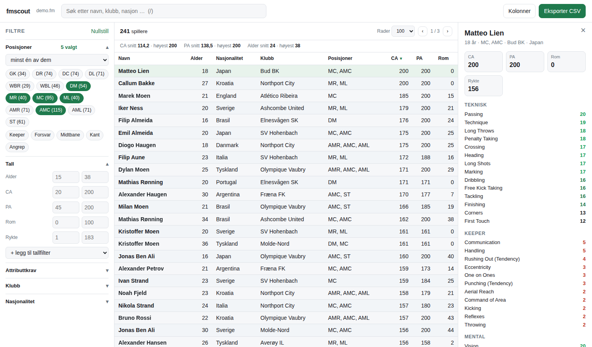
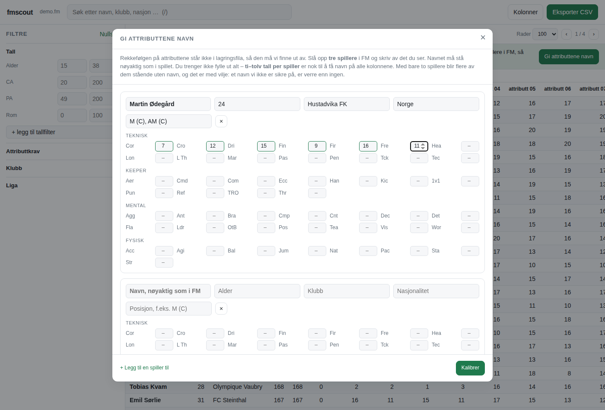

# fmscout

En speider for Football Manager-saver. Åpne fila, få alle spillerne i én
tabell du kan sortere, filtrere og eksportere til CSV.

Laget for Mac. Ingenting sendes ut av maskinen – tabellen kjører på
`127.0.0.1`, og saven blir liggende der den ligger.



## Kom i gang uten terminal

1. Last ned mappa: gå til
   [repoet på GitHub](https://github.com/kristofferme/hvgs/tree/claude/fm26-savegame-scout-cs38kh),
   trykk den grønne **Code**-knappen og velg **Download ZIP**.
2. Dobbeltklikk ZIP-fila i Nedlastinger så den pakkes ut.
3. Gå inn i `fmscout` → `Mac` og dobbeltklikk **FM Scout**.
4. Velg saven din i ruta som kommer opp. Tabellen åpner seg i nettleseren.

Første gang sier macOS trolig at appen ikke kan åpnes fordi den ikke er fra
App Store. Den er ikke signert – det koster penger – så det må du klarere selv
én gang:

* **Systeminnstillinger → Personvern og sikkerhet**, bla ned til *Sikkerhet*,
  og trykk **Åpne likevel** ved siden av «FM Scout».
* På eldre macOS: høyreklikk på appen → **Åpne** → **Åpne**.

Etterpå starter den som en hvilken som helst app, og du kan legge den i Dock.

Du kan gjerne flytte appen ut av mappa – til Programmer, Skrivebordet, hvor du
vil. Den leter seg fram til resten av verktøyet på egen hånd. Finner den det
ikke, spør den om å få vist `fmscout`-mappa én gang, og husker svaret. Selve
`fmscout`-mappa må du derimot beholde: det er der programmet ligger.

Appen trenger Python 3. Har du det ikke, sier den fra og tilbyr å åpne
python.org for deg.

## Eller fra terminalen

```bash
cd fmscout
python3 fmscout.py demo              # 900 oppdiktede spillere, alt virker
python3 fmscout.py åpne              # gir deg den samme «velg fil»-ruta
python3 fmscout.py åpne save.fm      # eller si hvilken fil med en gang
```

Demoen er verdt et minutt før du peker verktøyet mot din egen save: alt i
tabellen virker der, så du ser hva dette er.

## To veier inn

Det er to måter å få spillere inn i tabellen på, og de gir deg ulike ting.

### 1. En eksport fra FM – virker med en gang

I FM: gå til en spillerliste (stallen, et søk, en speiderrapport), marker alt
med ⌘A, trykk ⌘P og velg **Web Page (.html)**. Alle kolonnene du har i
visninga blir med i fila. Velg den fila i FM Scout på vanlig måte.

Dette virker alltid, uansett FM-versjon. Ulempen er at FM ikke viser CA og PA
noe sted, så de kolonnene får du ikke med. `.html`, `.rtf` og `.csv` går alle
sammen inn her.

Vil du slå sammen flere lister – stallen, speiderrapporten og de frie
spillerne – må det gjøres fra terminalen. Da beholder en spiller som står i to
av dem oppføringa med flest utfylte felt:

```bash
python3 fmscout.py åpne stall.html speiderliste.html frie-spillere.rtf
```

### 2. Selve saven – for CA og PA

Velg `.fm`-fila i stedet. På FM26 ligger den under
`~/Library/Application Support/Sports Interactive/Football Manager 26/games/`.

Første gang tar det litt tid: fila pakkes ut og legges i et mellomlager under
`~/Library/Caches/fmscout/`, så går det fort etterpå.

**Vær klar over hva dette er.** Sports Interactive dokumenterer ikke formatet
på lagringsfilene sine, og de endrer det mellom versjoner. Verktøyet har
derfor ingen ferdige tall for FM26 liggende i koden – det *leter* dem opp i
akkurat den fila du gir det:

* En save er mange deflate-komprimerte blokker etter hverandre. Vi går gjennom
  fila og pakker ut alt vi finner, uten å bry oss om hvordan indeksen ser ut.
* Attributtene til en spiller ligger etter hverandre, og alle er tall mellom 1
  og 20. En stripe på 16 eller flere slike bytes på rad skjer nesten aldri
  ellers – men den skjer én gang per spiller. Stripene gir tabellen, og
  avstanden mellom to striper gir lengden på én spillerrecord.
* CA og PA kjennes igjen på oppførselen: CA er den byten som følger
  attributtene tettest når du rangerer spillerne, og PA er den som har noen få
  prosent verdier i 246–255 – FM sin måte å si «potensialet ligger et sted i
  dette intervallet».
* Navn, klubb og nasjonalitet finnes ved å følge pekerne inn i strengtabellen.

Det som *ikke* går av seg selv, er hvilken attributt som er hvilken. Rekkefølgen
står ingen steder i fila. Der trenger verktøyet hjelp – se neste avsnitt.

Metoden er testet mot en fil som er bygd med samme form som en save (`python3
-m unittest discover -s tester`), der den finner igjen alle spillerne med alle
feltene uten et eneste offset skrevet inn på forhånd. Om den treffer like godt
på en ekte FM26-save, avhenger av hvordan SI har lagt opp akkurat den
versjonen. Blir noe feil, er det skjemaet som skal rettes, ikke koden – og
`sjekk` viser deg hva som faktisk ligger i fila.

## Kalibrering – gi attributtene riktig navn

Åpner du en save og attributtkolonnene heter `attributt 00`, `attributt 01` og
utover, er det som forventet. Verdiene er riktige – vi vet bare ikke hvilken av
dem som er Passing og hvilken som er Pace, for rekkefølgen står ingen steder i
fila. Det ordner du i nettsida:



Trykk **Gi attributtene navn** i den grønne stripa. Slå opp **tre spillere** i
FM og skriv av det du ser. Navnet må stå nøyaktig som i spillet, med aksenter og
alt. Ti–tolv tall per spiller holder – du trenger ikke fylle ut hele skjemaet.

Hvorfor tre? Med to spillere blir flere attributter stående uten navn, og det er
med vilje. To spillere gir ofte flere mulige plasser for samme attributt, og da
lar verktøyet det heller stå åpent enn å gjette. Et navn du ikke kan stole på,
er verre enn `attributt 07`. Med tre spillere løser det seg som regel helt.

Det du skriver inn blir husket i nettleseren, så du slipper å skrive det på nytt
om du vil legge til en spiller til.

Fra terminalen går det også:

```bash
python3 fmscout.py kalibrer --lag-ankermal ankere.json
# fyll ut fila, og så:
python3 fmscout.py kalibrer mitt-lag.fm --ankere ankere.json
```

Skjemaet lagres og blir brukt automatisk neste gang du åpner den saven. Har
spilleren en navnebror i databasen, sier verktøyet fra og velger den recorden
som passer med verdiene du oppga.

Vil du se hva som ligger i fila før du kalibrerer:

```bash
python3 fmscout.py sjekk mitt-lag.fm
```

Den viser blokkene, litt tekst fra dem, tabellene som ser ut som spillere, og
hvilke bytes som er kandidater til CA og PA.

## Tabellen

* **Søk** øverst treffer navn, klubb, liga og nasjonalitet. `/` hopper dit.
* **Posisjoner** – klikk på brikkene, eller ta en hel gruppe (Forsvar,
  Midtbane, Kant, Angrep). Velg om spilleren må kunne *minst én* av dem eller
  *alle*.
* **Tall** – alder, CA, PA, rom (PA minus CA), rykte, verdi, lønn. Trenger du
  flere, legger du dem til nederst i bolken.
* **Attributtkrav** – «Passing minst 15» og «Vision minst 14» samtidig, så
  mange du vil.
* **Klubb og nasjonalitet** – avkryssing med søkefelt og antall.
* **Kolonner** – velg fritt blant alle feltene, eller ta et ferdig sett:
  Nøkkeltall, Teknisk, Mental, Fysisk, Keeper, Skjult, Alt.
* Klikk på en overskrift for å sortere. Shift-klikk legger til et nivå til.
* Klikk på en rad for å se hele spilleren i panelet til høyre.
* **Åpne annen fil** øverst til høyre bytter save uten at noe må startes om.

Filtrene og kolonnevalget huskes til neste gang du åpner samme fil.

## CSV

Knappen **Eksporter CSV** laster ned det du ser – med de filtrene og den
sorteringa du har satt, ikke bare sida på skjermen. Du får spørsmål om du vil
ha alle kolonnene eller bare de synlige.

Fra terminalen:

```bash
python3 fmscout.py eksporter mitt-lag.fm -o spillere.csv
python3 fmscout.py eksporter stall.html -o utvalg.csv --kolonner navn,alder,klubb,ca,pa
python3 fmscout.py eksporter mitt-lag.fm -o data.csv --skilletegn ,
```

Standard er semikolon og desimalkomma, som er det Excel på en norsk Mac åpner
uten å spørre om noe. Skal tallene rett inn i pandas eller R, bruk
`--skilletegn ,` – da blir desimalskilletegnet punktum.

## Kommandoer

| Kommando | Gjør |
| --- | --- |
| `demo` | lager en oppdiktet save og åpner tabellen |
| `åpne [fil …]` | åpner tabellen; uten filnavn får du «velg fil»-ruta |
| `eksporter <fil …> -o ut.csv` | skriver rett til CSV |
| `sjekk <save.fm>` | viser hva som ligger i fila |
| `kalibrer <save.fm>` | finner ut hvordan saven er satt sammen |
| `skjemaer` | lister skjemaene du har fra før |

Nyttige valg: `--port` (fast portnummer), `--ikke-åpne` (ikke start
nettleseren), `--grense N` (les bare de første N spillerne mens du prøver deg
fram), `--skjema` (bruk et bestemt skjema), `--kalibrer-på-nytt`.

## Når noe ikke stemmer

**«Fant ingen tabell som ser ut som spillere.»** Da skriver verktøyet en
rapport til skrivebordet av seg selv – `fmscout-rapport.txt`. Den sier hva
fila faktisk inneholder: hvilke pakkemetoder som finnes i den, om blokkene lot
seg pakke ut, om det står lesbar tekst i dem, og om tallmønstrene som pleier å
være attributter finnes. Nederst står det hva funnene peker mot.

Du kan lage den samme rapporten når som helst ved å dobbeltklikke
**Lag feilrapport** i `Mac`-mappa og velge savefila.

**Klubb og liga er byttet om.** Åpne skjemaet (`skjemaer` viser hvor det
ligger) og bytt om de to offsetene. Det er en tekstfil, og den er ment å rettes
på.

**Attributtene heter `attributt 07`.** Da er de ikke kalibrert ennå – trykk
**Gi attributtene navn** i den grønne stripa. Står noen igjen etterpå, sier
statuslinja hvilke, og da trenger de flere tall eller en spiller til.

**«Fant ingen av spillerne i saven.»** Navnet må stå nøyaktig som i FM. Sjekk
aksenter, og prøv med hele navnet slik det står i spillerprofilen.

**CA og PA ser rare ut.** `sjekk` lister kandidatene med begrunnelse. Er det en
annen byte som ser riktigere ut, sett offsetet inn i skjemaet.

**«Fant ikke resten av verktøyet.»** Appen finner ikke `fmscout`-mappa. Trykk
**Vis meg mappa** og pek på den – den som inneholder `fmscout.py` og mappa
`Mac`. Det spørsmålet kommer bare én gang.

**Det tar lang tid første gang.** Utpakkinga går gjennom hele fila. En stor
save kan ta noen minutter. Etterpå ligger den i mellomlageret. Skal du rydde:
`rm -rf ~/Library/Caches/fmscout`.

## Tester

```bash
python3 -m unittest discover -s tester
```

32 tester som dekker utpakking, tabellsøk, kalibrering, import av
FM-eksporter, filtrering, CSV og tjeneren. To av dem holder kalibreringa i
ørene: at tre ankere med tolv tall gir navn på alt, og at to ankere heller lar
det tvetydige stå åpent enn å sette et navn som kan være feil.
