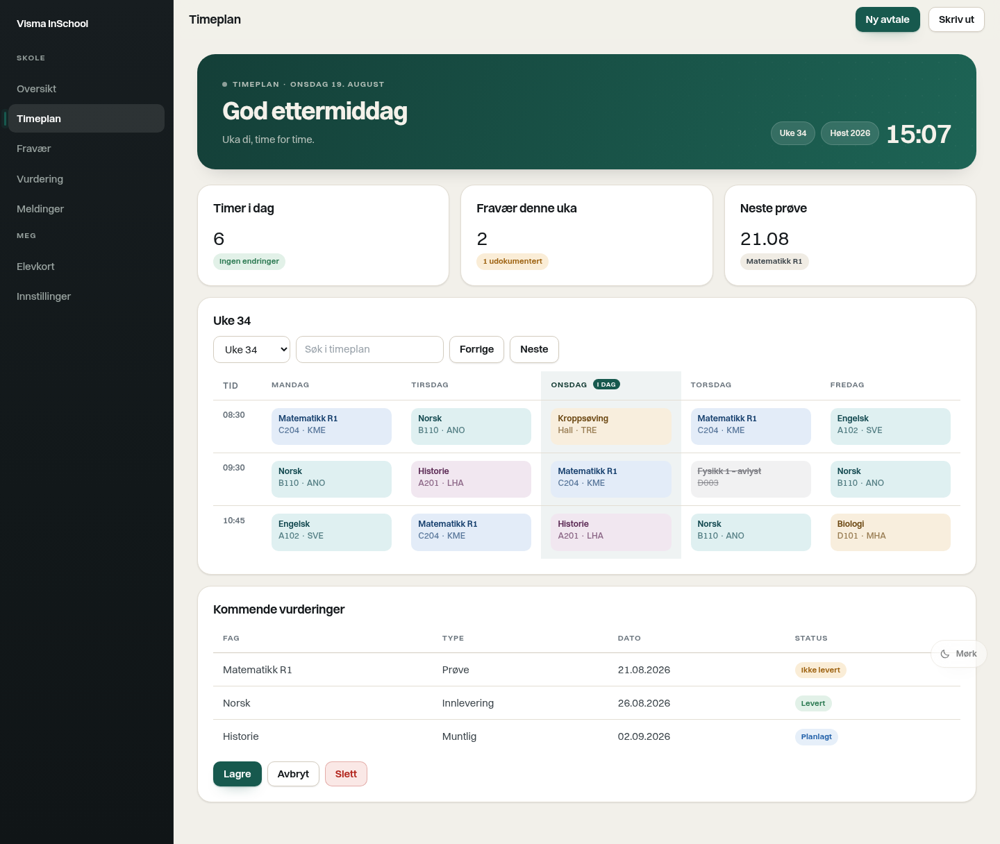
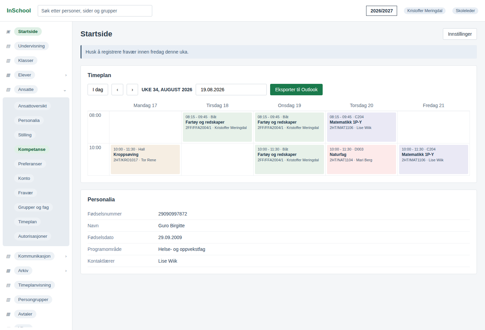
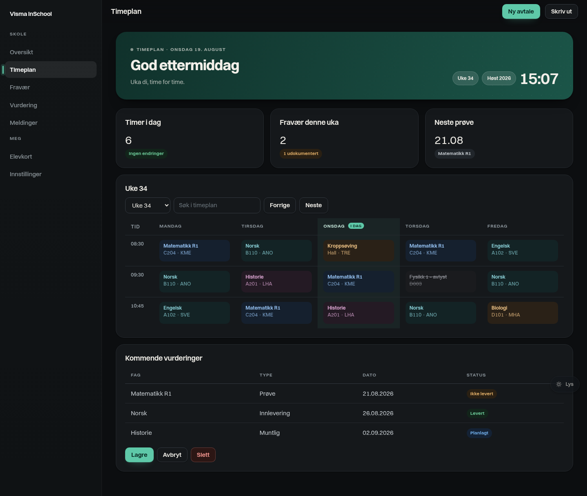

# Klar – moderne tema for Visma InSchool

En Chrome-utvidelse som gir Visma InSchool (`*.inschool.visma.no`) et rolig,
moderne og godt lesbart design – uten å endre hvordan tjenesten fungerer.



<table>
<tr>
<td width="50%"><br><em>Før</em></td>
<td width="50%"><br><em>Etter, mørk modus</em></td>
</tr>
</table>

## Hva du får

- **Tydelig sidemeny.** Mørk, rolig meny med aktiv markør, tydelig merkevareblokk og god luft.
- **Kort som ser ut som kort.** Én skyggeverdi, én kantfarge, konsekvent radius – ingen dobbelt innramming.
- **Hero øverst.** Hilsen etter tid på døgnet, dato, ukenummer, semester og klokke.
- **Fargekodet timeplan.** Hvert fag får sin faste, dempede tone – samme fag har samme farge hele uka.
  Dagens kolonne markeres med «I DAG», og avlyste timer tones ned.
- **Lys og mørk modus** (eller «auto» etter systemvalget), fem aksentfarger, to tettheter.
- **Typografi.** Switzer følger med utvidelsen i fire vekter, med systemfont som reserve.

## Installer

1. Last ned mappen `visma-inschool-theme/` (eller klon repoet).
2. Åpne `chrome://extensions` i Chrome.
3. Slå på **Utviklermodus** øverst til høyre.
4. Klikk **Last inn upakket** og velg mappen `visma-inschool-theme`.
5. Gå til `https://frena-vgs.inschool.visma.no/#/app/timetable` og last siden på nytt.

Utvidelsen kjører kun på `https://*.inschool.visma.no/*`.

## Bruk

- Klikk på ikonet i verktøylinja for å åpne panelet med innstillinger.
- Knappen nede til høyre bytter mellom lys og mørk.
- Hurtigtaster: `Alt+Shift+D` lys/mørk, `Alt+Shift+K` slår temaet av og på.

Innstillingene lagres i `chrome.storage.sync` og slår inn med én gang, uten omlasting.

| Innstilling | Valg | Standard |
| --- | --- | --- |
| Utseende | Auto / Lys / Mørk | Auto |
| Aksentfarge | Gran, Hav, Plomme, Rav, Kobolt | Gran |
| Tetthet | Luftig / Kompakt | Luftig |
| Sidemeny | Mørk / Lys | Mørk |
| Hero øverst | på / av | på |
| Fargekodet timeplan | på / av | på |
| Snarveiknapp | på / av | på |

## Designsystemet

**Farge.** Lys modus er varmt papir (`#f2f0ea`) med hvite flater, ikke kald grå – det gir
mindre flimmer på en skjerm man ser på hele skoledagen. Mørk modus er nøytralt kull med
flater som skiller seg fra bakgrunnen på lystyrke, ikke på kant. Aksenten er dyp gran
(`#17594e`) i lys modus og mynte (`#5ec8a8`) i mørk, slik at kontrasten holder seg over
4.5:1 begge veier. Statusfarger (grønn, gul, rød, blå) er dempet mot samme papirtone,
og timeplanen bruker ti toner som er valgt for å kunne stå ved siden av hverandre.

**Typografi.** Switzer (Indian Type Foundry, via Fontshare) i vektene 400/500/600/700 –
en nøytral grotesk med åpne former som tåler små størrelser. Strammere sporing på
overskrifter, tabulære tall i tabeller og timeplan, og små, versale etiketter til
seksjonsoverskrifter.

**Farge som flate, ikke som kant.** Ingen fargede rammer, streker eller kantlinjer på
kort og timer – fargen ligger i flaten, kanten er alltid nøytral. Bakgrunnen er ensfarget,
og heroen bruker én fargefamilie i stedet for flere toner om hverandre.

**Form.** Én radiusskala (6/10/14/20/26 px), tre skyggenivåer, og bevegelse kun der den
forklarer noe – 180 ms, alltid med respekt for `prefers-reduced-motion`.

Alt ligger som variabler i [`css/tokens.css`](css/tokens.css). Vil du endre paletten,
er det den ene filen du trenger å røre.

## Slik virker det

Visma InSchool er en Angular-app med genererte klassenavn som kan endre seg mellom
versjoner. Temaet er derfor ikke låst til bestemte klasser. I stedet leser
[`js/classify.js`](js/classify.js) siden slik en bruker ser den – geometri, ARIA-roller,
farger og innhold – og merker elementene med `data-klar-el="sidebar | topbar | main |
card | nav-item | btn | field | table | badge | event | surface | backdrop"`.
CSS-en styler kun disse merkelappene.

Noen detaljer som er verdt å vite:

- **Opprinnelige farger huskes.** Første gang et element ses, lagres sidens egne farger.
  Uten det ville neste skann lest våre egne farger og gradvis feilklassifisert alt.
- **Flater males om.** Nesten-hvite og grå flater knyttes til paletten, og i mørk modus
  lysnes tekst som ellers ville forsvunnet. Elementer vi allerede har gitt en rolle,
  røres ikke.
- **Ruteendringer følges.** `hashchange`, `popstate` og `history.pushState` utløser nytt
  skann, i tillegg til en `MutationObserver` for innhold som lastes underveis.
- **Stilarkene holdes bakerst** i `<html>`, slik at appens egne, dynamisk innlastede ark
  ikke overstyrer temaet.
- **Skriften lastes med FontFace-API-et** fra utvidelsens egne filer, som også virker om
  siden har streng CSP for `font-src`.

## Personvern

Utvidelsen leser ingen skoledata og sender ingenting noe sted. Den har `storage` for egne
innstillinger og tilgang til `*.inschool.visma.no` for å kunne style siden. Ingen
nettverkskall, ingen sporing, ingen eksterne ressurser – Switzer ligger i utvidelsen.

## Utvikling

```
visma-inschool-theme/
├── manifest.json
├── css/     tokens, base, layout, komponenter, timeplan
├── js/      settings, inject, classify, hero, main, background
├── popup/   innstillingspanel
├── fonts/   Switzer 400/500/600/700 + NOTICE.md
└── test/    testsider + skjermbildeoppsett (Playwright)
```

Testsidene etterligner to ganske ulike DOM-strukturer, slik at strukturgjenkjenningen
kan prøves uten innlogging:

```bash
npx http-server test -p 8899 -s &
node test/screenshot.js            # skriver bilder til test/shots/
```

Skriptet bygger en midlertidig kopi av utvidelsen som også treffer `localhost`, laster
den i Chromium og skriver ut hva som ble gjenkjent på hver side.

## Kjente begrensninger

- Temaet er utviklet og testet mot to testsider som etterligner InSchool, ikke mot en
  innlogget konto. Strukturgjenkjenningen er laget for å tåle ukjent markup, men om en
  skjerm i den ekte tjenesten ser feil ut, er det som regel nok å justere terskler i
  `js/classify.js` eller legge til en regel i `css/components.css`.
- Utvidelsen endrer bare utseende. Den fyller ikke ut skjemaer, henter ikke data og
  endrer ikke funksjonalitet.
